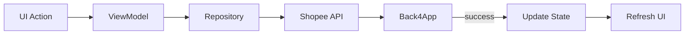

# 🚀 RayShopeeAndroid — App Android Nativo

**Status:** 🟢 **PROJETO PRINCIPAL (10/10)** — Foco total de desenvolvimento

> Aplicativo Android nativo em Kotlin para gestão de inventário e precificação Shopee, com scanner de código de barras, cálculo de margens e integração multi-API (Supabase + Shopee).

---

## 📱 Visão Geral

O RayShopeeAndroid é o aplicativo mobile principal do ecossistema RayShopee, desenvolvido em **Kotlin com Jetpack Compose**, focado em vendedores Shopee que precisam:

- ✅ Escanear códigos de barras rapidamente
- ✅ Consultar preços e estoque em tempo real
- ✅ Calcular margens de lucro automaticamente
- ✅ Atualizar preços e estoque via API
- ✅ Gestão completa de variações de produtos

---

## 🏗️ Arquitetura

### Stack Tecnológico

| Camada | Tecnologia | Versão |
|--------|-----------|--------|
| **Linguagem** | Kotlin | 2.3.10 |
| **UI** | Jetpack Compose | 2026.03.00 |
| **DI** | Hilt | 2.59.2 |
| **Rede** | Retrofit + Kotlinx Serialization | 2.11.0 |
| **Banco Local** | Room | 2.8.4 |
| **Câmera** | CameraX | 1.4.1 |
| **Scanner** | MLKit Barcode | 17.3.0 |
| **Async** | Coroutines | 1.9.0 |
| **Build** | AGP | 9.0.0 |

### Módulos

```
RayShopeeAndroid/
├── app/
│   ├── src/main/
│   │   ├── java/com/rayshopee/app/
│   │   │   ├── MainActivity.kt          # Entrada principal
│   │   │   ├── RayShopeeApplication.kt  # App Hilt
│   │   │   │
│   │   │   ├── di/
│   │   │   │   └── RepositoryModule.kt  # Injeção de dependência
│   │   │   │
│   │   │   ├── data/
│   │   │   │   ├── model/               # Modelos de domínio
│   │   │   │   │   ├── Product.kt
│   │   │   │   │   └── ...
│   │   │   │   │
│   │   │   │   └── repository/          # Camada de dados
│   │   │   │       ├── ProductRepository.kt
│   │   │   │       └── ProductRepositoryImpl.kt
│   │   │   │
│   │   │   └── ui/
│   │   │       ├── screens/
│   │   │       │   ├── ScannerScreen.kt     # Tela principal
│   │   │       │   └── ScannerViewModel.kt  # Lógica de estado
│   │   │       │
│   │   │       └── theme/                   # Temas e cores
│   │   │
│   │   └── res/                            # Recursos Android
│   │
│   ├── build.gradle.kts                    # Configuração do app
│   └── proguard-rules.pro
│
├── gradle/
│   ├── libs.versions.toml                  # Versões de dependências
│   └── wrapper/
│
├── build.gradle.kts                        # Configuração raiz
├── settings.gradle.kts
└── gradle.properties
```

---

## 🎯 Funcionalidades

### 1. Scanner de Código de Barras 📷

- **CameraX** para preview em tempo real
- **MLKit Barcode Scanning** para detecção automática
- Processamento contínuo sem bloqueio de UI
- Auto-foco e controle de exposição

```kotlin
SimpleCameraContent { barcode ->
    // Callback quando código é detectado
    scannedBarcode = barcode
}
```

### 2. Busca Multi-Fonte 🔍

**Prioridade de busca:**

1. **Supabase** (primária) - Busca direta via REST API
   - Por SKU (SKU filho/variação)
   - Por GTIN/EAN (código de barras)
   - Por item_id (ID do produto pai)

2. **Shopee API** (secundária) - Via servidor Node.js
   - `/api/products/barcode` - Busca por código de barras
   - `/api/products/item/{itemId}` - Busca por ID
   - `/api/products/sku/{sku}` - Busca por SKU

**Sistema de Retry:**
- 3 tentativas com backoff exponencial (2s, 4s)
- Timeout de 15 segundos
- Tratamento de erros graceful

### 3. Gestão de Estoque e Preços 📊

```kotlin
// Atualizar preço
repository.updatePrice(itemId, variationId, novoPreço)

// Atualizar estoque
repository.updateStock(itemId, variationId, novaQuantidade)
```

**Operações via API Shopee:**
- `POST /api/products/update-price`
- `POST /api/products/update-stock`
- Atualização otimista na UI
- Tratamento de concorrência

### 4. Cálculo de Rentabilidade 💰

**Fórmula:**
```
Lucro = Receita - Custo - Comissão - Impostos
Margem = (Lucro / Receita) × 100
```

**Taxas Aplicadas:**
- 📦 Comissão da plataforma: 0.08% a 0.25% (escalonada)
- 💰 Taxa fixa: R$ 4.00 a R$ 46.00 (escalonada)
- 🏛️ Imposto governo: 6%
- 🔄 Taxa transação: 2%
- 🎁 Subsídio PIX: 0% a 2% (acima de R$ 80)

**Faixas de Comissão:**

| Preço Mínimo | Comissão | Fixo | Subsídio PIX |
|-------------|----------|------|--------------|
| R$ 0,00 | 0.25% | R$ 4,00 | 0% |
| R$ 12,00 | 0.20% | R$ 4,00 | 0% |
| R$ 80,00 | 0.14% | R$ 16,00 | 1% |
| R$ 100,00 | 0.14% | R$ 16,00 | 1% |
| R$ 150,00 | 0.12% | R$ 22,00 | 1% |
| R$ 300,00 | 0.10% | R$ 36,00 | 2% |
| R$ 500,00 | 0.08% | R$ 46,00 | 2% |

---

## 🔧 Configuração do Ambiente

### Pré-requisitos

- Android Studio Hedgehog (2023.1.1) ou superior
- JDK 25
- Kotlin 2.3.10
- Gradle 9.0.0
- Emulador ou dispositivo físico (API 26+)

### Variáveis de Ambiente

O app consome as seguintes configurações:

```bash
# Supabase (banco de dados principal)
SUPABASE_BASE_URL=https://xcvazbfjkiddzlxwynni.supabase.co
SUPABASE_API_KEY=sb_publishable_...

# Back4App/Shopee API (secundária)
# Configurada no servidor Node.js
```

> ⚠️ **Nota:** As chaves da Supabase estão hardcoded no `ScannerScreen.kt`. Em produção, use Android Keystore ou backend proxy.

### Build

```bash
# Clone o repositório
cd RayShopeeAndroid

# Sync Gradle
./gradlew sync

# Build debug
./gradlew assembleDebug

# Build release
./gradlew assembleRelease

# Run no emulador
./gradlew installDebug
```

---

## 📐 Arquitetura de Software

### Clean Architecture (Parcial)

```
UI Layer (ScannerScreen)
    ↓
ViewModel (ScannerViewModel) ← StateFlow
    ↓
Repository (ProductRepository)
    ↓
Data Sources
    ├── Remote (Retrofit + Supabase REST)
    └── Local (Room - futuro)
```

### Padrões Utilizados

- **MVVM** - Separação de responsabilidades
- **Repository Pattern** - Abstração de fontes de dados
- **Dependency Injection** - Hilt para injeção
- **Coroutines** - Programação assíncrona
- **StateFlow** - Estado reativo
- **Jetpack Compose** - UI declarativa

### Limitações Conhecidas

1. **ScannerScreen não usa ViewModel** - Lógica de rede está na UI
2. **Chaves hardcoded** - Supabase API key exposta
3. **Sem cache local** - Room configurado mas não utilizado
4. **Mix de paradigmas** - Parte procedural, parte Clean Arch

---

## 🔍 Fluxo de Dados

### Busca por Código de Barras

```mermaid
graph TD
    A[ScannerScreen] -->|barcode| B[searchItemById()]
    B --> C{Supabase REST}
    C -->|SKU/EAN/ID| D[Parse Result]
    D --> E[calculateProfit()]
    E --> F[Update UI]
    
    G[Repository] -->|opcional| H[Shopee API]
    H -->|updatePrice/Stock| I[Back4App]
```

### Atualização de Preço



---

## 🧩 Componentes Principais

### ScannerScreen.kt

- Tela única do aplicativo
- Camera preview + painel de resultados
- Busca em tempo real
- Cálculo de margens

### ScannerViewModel.kt

- Gerenciamento de estado UI
- Processamento de intents
- Tratamento de erros
- Loading states

### ProductRepositoryImpl.kt

- Implementação da camada de dados
- Integração Supabase (primária)
- Integração Shopee API (secundária)
- Retry logic e timeout

### Product.kt

- Modelos de domínio
- `Product` - Produto pai
- `ProductVariation` - Variações
- DTOs de request/response

---

## 🌐 APIs Integradas

### 1. Supabase (Primária)

**Base URL:** `https://xcvazbfjkiddzlxwynni.supabase.co`

**Endpoints:**
- `GET /rest/v1/products?sku=eq.{sku}` - Busca por SKU
- `GET /rest/v1/products?GTIN_EAN_BarCode=eq.{barcode}` - Busca por EAN
- `GET /rest/v1/products?item_id=eq.{id}` - Busca por item_id

**Tabela:** `products`
```sql
- item_id (text)
- model_id (text)
- name (text)
- sku (text)
- variation_name (text)
- shopee_price (numeric)
- shopee_stock (integer)
- cost (numeric)
- GTIN_EAN_BarCode (text)
- is_active (boolean)
```

### 2. Shopee API via Back4App (Secundária)

**Base URL:** `https://rayshopeeapi-8ivucqzy.b4a.run`

**Endpoints:**
- `GET /api/wakeup` - Health check
- `GET /api/products/barcode?barcode={}` - Busca por código
- `GET /api/products/item/{itemId}` - Detalhes do item
- `GET /api/products/sku/{sku}` - Busca por SKU
- `POST /api/products/update-price` - Atualiza preço
- `POST /api/products/update-stock` - Atualiza estoque

**Autenticação:** OAuth 2.0 (Shopee Partner API)
- HMAC-SHA256 signature
- Token auto-refresh

---

## 🎨 UI/UX

### Design System

- **Material 3** - Componentes padrão
- **Dynamic Color** - Cores do sistema (Android 12+)
- **Dark/Light Theme** - Alternância automática

### Telas

#### ScannerScreen

**Layout:**
```
┌─────────────────────────┐
│  Camera Preview (70%)   │
│  [Real-time scanner]    │
│                         │
├─────────────────────────┤
│  ┌───────────────────┐  │
│  │  Painel Resultados│  │
│  │  (30%)            │  │
│  │  - Botão Buscar   │  │
│  │  - Dados produto  │  │
│  │  - Variações      │  │
│  │  - Margem lucro   │  │
│  └───────────────────┘  │
└─────────────────────────┘
```

**Componentes:**
- `SimpleCameraContent` - Preview da câmera
- `processImage` - Processamento MLKit
- `calculateProfit` - Cálculo financeiro
- `parseSupabaseResult` - Parse JSON

---

## 🧪 Testes

### Testes Unitários

```bash
./gradlew testDebugUnitTest
```

### Testes de Instrumentação

```bash
./gradlew connectedDebugAndroidTest
```

### Testes de UI

- Espresso (legado)
- Compose Testing (recomendado)

---

## 🚀 Deploy

### Google Play Store

```bash
# Build assinado
./gradlew assembleRelease

# Bundle
./gradlew bundleRelease

# Upload via Play Console
```

### Configurações Release

- `minifyEnabled = false` (atualmente)
- `proguardFiles` - Configuração padrão
- `signingConfig` - Debug (migrar para release)

---

## 📊 Monitoramento

### Logs

- `HttpLoggingInterceptor` - Nível BASIC
- Console logs em operações críticas
- Tratamento de erros detalhado

### Métricas

- Tempo de resposta API
- Taxa de sucesso de scanner
- Cache hit/miss ratio
- Erros de rede

---

## 🔄 Roadmap

### Prioridade Alta

- [ ] Integrar ScannerViewModel na UI
- [ ] Implementar cache local (Room)
- [ ] Unificar fontes de dados (Repository)
- [ ] Adicionar testes unitários
- [ ] Configurar CI/CD

### Prioridade Média

- [ ] Migração para Koin (opcional)
- [ ] Modularização do app
- [ ] Suporte a tablets
- [ ] Modo offline completo

### Prioridade Baixa

- [ ] Widget home screen
- [ ] Notificações push
- [ ] Backup cloud
- [ ] Multi-idioma

---

## 🐛 Troubleshooting

### Problemas Comuns

**1. Scanner não detecta códigos**
```bash
# Verificar permissões
adb shell pm list permissions -g

# Limpar cache
./gradlew clean
```

**2. Erro de rede**
```bash
# Testar API
curl https://xcvazbfjkiddzlxwynni.supabase.co/rest/v1/products

# Verificar network security config
cat app/src/main/res/xml/network_security_config.xml
```

**3. Build falha**
```bash
# Sync Gradle
./gradlew --refresh-dependencies

# Limpar projeto
./gradlew clean
./gradlew assembleDebug
```

---

## 📚 Documentação

### Recursos

- [Android Developers](https://developer.android.com/)
- [Jetpack Compose](https://developer.android.com/jetpack/compose)
- [Hilt Documentation](https://dagger.dev/hilt/)
- [Retrofit](https://square.github.io/retrofit/)
- [Supabase](https://supabase.com/docs)

### Links Úteis

- [Shopee Partner API](https://open.shopee.com/)
- [MLKit Barcode Scanning](https://developers.google.com/ml-kit)
- [CameraX Guide](https://developer.android.com/training/camerax)

---

## 👥 Equipe

**Projeto:** RayShopeeAndroid  
**Líder:** [Seu Nome]  
**Stack:** Kotlin, Jetpack Compose, MVVM  
**Status:** 🟢 Produção (Foco Total)

---

## 📄 Licença

Proprietário — RayShopee Team  
© 2026 Todos os direitos reservados

---

## ⭐ Contribuição

1. Fork o projeto
2. Crie uma branch (`git checkout -b feature/amazing`)
3. Commit suas mudanças (`git commit -m 'Add amazing feature'`)
4. Push para a branch (`git push origin feature/amazing`)
5. Abra um Pull Request

---

**Última Atualização:** Maio 2026  
**Versão:** 1.0.1  
**Importância:** 🔴 **10/10 - PROJETO PRINCIPAL**